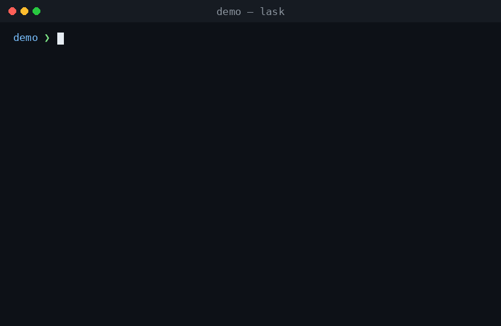

# Lask

[](https://github.com/lask-task-runner/lask/actions/workflows/test.yml)
[](https://github.com/lask-task-runner/lask/releases/latest)
[](LICENSE)

Lask (lambda + task) is a task runner with a small language behind it, giving automation what shell scripts and CI YAML never had: portability, reproducibility, and verification before anything runs.

Lask is for anyone who finds Makefiles and Taskfiles not quite enough, and Dagger or Earthly too much. The first are screwdrivers from the kitchen drawer; the second, a factory floor of your own to operate — its own engine, its own SDK, a general-purpose language and its entire ecosystem. Lask is the garage in between: install Docker and Lask, and you have everything you need.

<div align="center">
  <picture>
    <source media="(prefers-color-scheme: dark)" srcset="doc/assets/main-dark.svg">
    
  </picture>
</div>

<details>
<summary>Copy the source of this example</summary>

```lask
// Environments are values: pin an image once, reuse it everywhere.
go    = #golang:1.22
node  = #node:20
// A custom image builds from a Dockerfile and is used the same way.
infra = #docker(dockerfile = "Dockerfile", context = ".")

// Declare which image provides each program, and the commands below
// name only what they run. There is no default: a command with no
// environment is an error, never a silent fall back to the host.
command "go" on go
command "npm" on node
command "terraform" on infra

test_api(): String = $ go test ./...
test_web(): String = $ npm test

// Both suites run concurrently; the build and deploy follow in order.
//
// @param dry_run  Run `terraform plan` instead of `terraform apply`.
// @example lask run release --dry-run true
release(--dry_run = false) = do {
  api = async test_api()
  web = async test_web()
  await api
  await web
  $ go build
  if (dry_run) {
    $ terraform plan
  } else {
    $ terraform apply -auto-approve
  }
}
```

</details>

Beyond the snippet above: [example/03-terraform](example/03-terraform) drives Terraform through hash-pinned shared tasks, and [example/04-webapp](example/04-webapp) builds and deploys a full AWS stack — a Python Lambda API, a React front end, RDS Postgres, Cognito, CloudFront and S3, with Playwright end-to-end tests — from a machine with none of those tools installed.

## Why Lask

Lask makes automation *verifiable*, *portable*, *programmable*, *reusable*, *runnable* and *discoverable*.

**Verifiable**. `lask check` resolves every name, argument and type before a single command runs — over the very definitions CI will execute, with no second copy in YAML to drift out of sync. The same errors appear in your editor as you type, so a typo costs seconds instead of a red CI log.

**Portable**. An execution environment is a value: pin an image once with `command "go" on #golang:1.22`, and every command that names it runs there — reproducibly, on your laptop and in CI alike. A command that names no environment is a static error, never a silent fall back to the host, so the only things to install are Lask and Docker.

**Programmable**. A task is an ordinary function — typed keyword arguments with defaults, a return value, callable on its own. Control flow, error handling and concurrency belong to the language rather than to shell convention. That language is a DSL and not a general-purpose one, so the same task takes fewer lines than an SDK in Go or TypeScript would, with no project to build around it.

**Reusable**. Inside a project, tasks call each other like the functions they are; across projects, shared tasks live in their own repository and are imported rather than copied. Imports are pinned by content hash in a committed lock file, so every machine resolves the same code and a run reaches no network.

**Runnable**. The CLI is small, and every piece of a project runs on its own: a task with `lask run`, an expression in the REPL, or a one-off command inside its own container with `lask cmd go test ./...`. Nothing has to be pushed, and nothing has to be run through a shell to try it. A task's signature is its command line, too: keyword arguments become flags, so `release(--dry_run = false)` is `lask run release --dry-run true` with nothing to wire up.

**Discoverable**. A documentation comment above a task — `@param`, `@return`, `@example` — is the single source for both `--help` and the editor's hover, so prose never drifts from the code it describes. Types are already in the source, so `--help` needs no hand-written usage string: it reports the signature, the inferred return type, and every image the task will need before you run it.

## Install

<details open>
<summary><b>macOS</b> &middot; Homebrew</summary>

```bash
$ brew tap lask-task-runner/tap
$ brew trust lask-task-runner/tap
$ brew install lask
```

</details>

<details>
<summary><b>macOS / Linux</b> &middot; download the binary</summary>

```bash
$ VERSION=$(curl -fsSL https://api.github.com/repos/lask-task-runner/lask/releases/latest | grep -m1 '"tag_name"' | cut -d '"' -f4)
$ TARGET=linux-amd64 # or macos-amd64, macos-arm64
$ curl -fsSL -o lask.tar.gz "https://github.com/lask-task-runner/lask/releases/download/${VERSION}/lask-${VERSION}-${TARGET}.tar.gz"
$ tar -xzf lask.tar.gz
$ sudo mv ./lask /usr/local/bin
```

Uninstall with `sudo rm /usr/local/bin/lask`.

</details>

<details>
<summary><b>Windows</b> &middot; PowerShell</summary>

```powershell
> $version = (Invoke-RestMethod https://api.github.com/repos/lask-task-runner/lask/releases/latest).tag_name
> Invoke-WebRequest -Uri "https://github.com/lask-task-runner/lask/releases/download/$version/lask-$version-windows-amd64.zip" -OutFile lask.zip
> Expand-Archive -Path lask.zip -DestinationPath "$env:LOCALAPPDATA\Programs\lask" -Force
> setx PATH "$env:PATH;$env:LOCALAPPDATA\Programs\lask"
```

Restart your terminal for the updated `PATH` to take effect. Uninstall with
`Remove-Item -Recurse -Force "$env:LOCALAPPDATA\Programs\lask"`.

</details>

<details>
<summary><b>From source</b> &middot; Haskell toolchain</summary>

Needs [GHCup](https://www.haskell.org/ghcup/) or `brew install haskell-stack`.

```bash
$ stack --local-bin-path /usr/local/bin/ install
```

</details>

Verify with `lask --help`. Archives for every platform are on the
[latest release](https://github.com/lask-task-runner/lask/releases/latest); APT and
Chocolatey support is planned.

<details>
<summary><b>Shell completion</b> &middot; bash, zsh, fish</summary>

Completion knows your module, not just the CLI: it completes the functions the
repository you are standing in defines, each function's keyword parameters, and
the commands it declares.

```bash
$ lask run <TAB>
build_on_docker  doctest  install  test  uninstall  unittest
$ lask run install --<TAB>
--output  --env  --help
$ lask run install --env <TAB>
docker  local
$ lask cmd <TAB>
mv  rm  stack  uname
```

**fish** — nothing else to do:

```fish
$ lask completion fish > ~/.config/fish/completions/lask.fish
```

**bash** — write the script somewhere and source it:

```bash
$ mkdir -p ~/.bash_completion.d
$ lask completion bash > ~/.bash_completion.d/lask
```

then, in `~/.bash_profile` (macOS Terminal starts a login shell, which does not
read `~/.bashrc`) or in `~/.bashrc` (Linux):

```bash
source ~/.bash_completion.d/lask
```

With the `bash-completion` package installed — most Linux distributions have it
— writing the script to `~/.local/share/bash-completion/completions/lask`
instead loads it on demand, with nothing added to your rc file. That directory
does nothing on a system without the package, which includes a stock macOS.
Note that `source <(lask completion bash)` cannot be used there either: the
`source` builtin in bash 3.2, still macOS's `/bin/bash`, silently reads nothing
from a process substitution.

**zsh** — the completion system has to be switched on, which macOS does not do
for you:

```zsh
$ mkdir -p ~/.zsh/completions
$ lask completion zsh > ~/.zsh/completions/_lask
```

then, in `~/.zshrc`:

```zsh
fpath=(~/.zsh/completions $fpath)
autoload -Uz compinit && compinit
```

If `compinit` already runs in your `~/.zshrc` — every framework does it for you
— only the `fpath` line is new, and any directory already on `$fpath` works just
as well. `compinit` caches what it found, so after adding a file, delete
`~/.zcompdump*` and open a new shell. If completion does nothing and
`command not found: compdef` appears when zsh starts, `compinit` has not run.

The script only ever asks the binary, so it keeps working across upgrades.
Completion reads your module without running it: no task, no default value, and
no environment is ever evaluated to answer a `<TAB>`.

</details>

## Comparison

Lask is a task runner, not a build system — and not a CI platform. It does not replace GitHub Actions, GitLab CI, or Jenkins; it replaces what your jobs run, so one definition executes on your laptop and inside whatever runner you already have. Your provider's YAML keeps the part it is genuinely good at — triggers, permissions, secrets — wrapped around a step that calls `lask run`. Switching providers then means rewriting that step, not your pipeline.

Here is how Lask compares to the lighter tools it replaces and to the heavier one it stops short of:

|                                         | Lask | make | Taskfile | Dagger |
| --------------------------------------- | :--: | :--: | :------: | :----: |
| Static checks before execution           | ✅ types, names, arity (`lask check`) | — | schema only | via the SDK's language |
| Typed task arguments with defaults       | ✅ `--name: String = "World"` | — | untyped vars | ✅ in the SDK's language |
| Execution environments as values         | ✅ `command "go" on #golang:1.22` | — | — | ✅ containers in the API |
| Concurrency                              | ✅ `async` / `await` | `-j` (per-target) | `deps` run in parallel | ✅ implicit in the DAG |
| Code reuse across projects               | ✅ hash-pinned module imports | `include` | `includes` | ✅ Git modules |
| Incremental rebuilds                     | — | ✅ file targets | ✅ checksum / timestamp | ✅ content-addressed cache |
| Config format                            | typed DSL | Makefile | YAML | Go / Python / TypeScript |
| What you install                         | single binary + Docker | preinstalled | single binary | binary + engine + SDK toolchain |

**When to use something else:**

- If your tasks are primarily *"rebuild only what changed"* over file targets, `make` (or a real build system like Bazel) is the right tool. Lask does not track file freshness.
- If you need artifact caching at build-system scale, or you want your pipeline written in Go or TypeScript with a full SDK behind it, Dagger goes further than Lask does — at the cost of an engine to run and an ecosystem to keep.

**When Lask pays off:** tasks that take arguments, call each other, run in pinned Docker environments, or run concurrently — the point where Makefiles and YAML pipelines usually turn into untestable shell scripts. `lask check` verifies all of it before anything executes.

## Example

<div align="center">
  
</div>

Tasks are ordinary functions, so you can ask one for its return value instead of running it:

```bash
$ cd ./example/01-basic
$ lask eval hello --name Lask
"Hello, Lask!"
```

`hello` is a pure function and needs nothing installed; `cowsay_hello` calls it and runs the result in a container, so that one needs Docker. Every command Lask runs is logged with the environment it ran in, the stream each line came from (`1|` stdout, `2|` stderr), and its exit status.

<details>
<summary>The recorded run, as text</summary>

```bash
$ lask run cowsay-hello Lask
2026-09-04T15:43:40.248Z [#rancher/cowsay:1] $ cowsay "Hello, Lask!"
2026-09-04T15:43:40.541Z [#rancher/cowsay:1] 1|  ______________
2026-09-04T15:43:40.541Z [#rancher/cowsay:1] 1| < Hello, Lask! >
2026-09-04T15:43:40.542Z [#rancher/cowsay:1] 1|  --------------
2026-09-04T15:43:40.542Z [#rancher/cowsay:1] 1|         \   ^__^
2026-09-04T15:43:40.542Z [#rancher/cowsay:1] 1|          \  (oo)\_______
2026-09-04T15:43:40.543Z [#rancher/cowsay:1] 1|             (__)\       )\/\
2026-09-04T15:43:40.543Z [#rancher/cowsay:1] 1|                 ||----w |
2026-09-04T15:43:40.544Z [#rancher/cowsay:1] 1|                 ||     ||
2026-09-04T15:43:40.858Z [#rancher/cowsay:1] exit 0
```

</details>

## Editor Support

Because tasks are typed, the editor can help in ways it cannot with a shell script. `lask serve` is a language server built into the same binary, so the VS Code extension gives you the errors `lask check` would report as you type, plus go-to-definition, autocomplete, hover types, and inlay hints for inferred ones.

Install the [Lask extension from the VS Code Marketplace](https://marketplace.visualstudio.com/items?itemName=ToruIkeda.vscode-lask), or search for "Lask" in VS Code.

## Usage

```bash
$ lask check                       # static validation
$ lask run <function> [args...]    # execute (result not printed)
$ lask eval <function> [args...]   # execute and print the result as JSON
$ lask cmd <command> [args...]     # run a declared command in its declared image
$ lask envs [--check]              # list/check referenced environments
$ lask env build | list            # materialize / inspect container images
$ lask deps sync                   # fetch + verify external dependencies
$ lask deps add <name> --git <url> --rev <rev>   # or --url <url>
$ lask deps why <name>             # show why a dependency is in the graph
$ lask repl                        # interactive session
$ lask serve                       # language server (LSP)
$ lask version                     # print the lask version
```

Function and keyword-argument names map from kebab-case on the CLI: `lask run show-version --out-dir /tmp` calls `show_version(--out_dir ...)`.

## Status

Lask is pre-1.0: features are `experimental` until the first tagged release, and breaking changes are still possible. See [doc/compatibility.md](doc/compatibility.md) for what `stable` will mean once released.

## Development

```bash
$ lask run test
```
