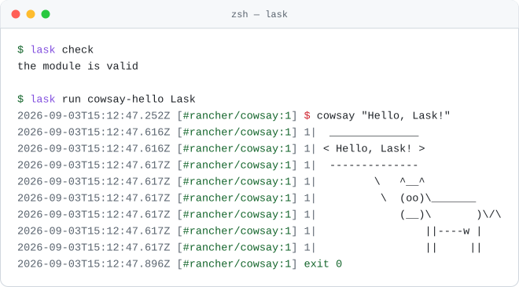

# Lask

Lask (lambda + task) is a locally verifiable, type-safe task runner. It brings the composability of functional programming to your daily automation and CI/CD pipelines.

Instead of sprawling shell scripts or YAML pipelines, tasks in Lask are plain functions with real types and arguments. This allows `lask check` to catch typos, missing arguments, and type mismatches before execution begins. Whether running on your laptop, inside a Docker container, or over SSH, the workflow remains cleanly reproducible.

The language, CLI, execution environments, and observability are defined by the specification in [doc/spec.md](doc/spec.md).

<div align="center">
  <picture>
    <source media="(prefers-color-scheme: dark)" srcset="doc/assets/main-dark.svg">
    
  </picture>
</div>

<details>
<summary>Copy the source of this example</summary>

```lask
// Environments are values: this task runs inside a Docker image, so
// nothing has to be installed locally.
cowsay(message: String): String = $[#rancher/cowsay] cowsay "#{message}"

// Types are inferred, so annotations are optional — and a task that
// runs no command at all is just a pure function.
hello(--name = "World") = "Hello, #{name}!"

// Tasks compose: call another task exactly like an ordinary function.
// >>> lask run cowsay-hello Lask
cowsay_hello(name: String) = do {
  message = hello(name = name)
  cowsay(message)
}
```

</details>

Running it:

<div align="center">
  <picture>
    <source media="(prefers-color-scheme: dark)" srcset="doc/assets/session-dark.svg">
    
  </picture>
</div>

### Install

<details open>
<summary><b>macOS</b> &middot; Homebrew</summary>

```bash
$ brew tap lask-task-runner/tap
$ brew trust lask-task-runner/tap
$ brew install lask
```

</details>

<details>
<summary><b>macOS / Linux</b> &middot; download the binary</summary>

```bash
$ VERSION=$(curl -fsSL https://api.github.com/repos/lask-task-runner/lask/releases/latest | grep -m1 '"tag_name"' | cut -d '"' -f4)
$ TARGET=linux-amd64 # or macos-amd64, macos-arm64
$ curl -fsSL -o lask.tar.gz "https://github.com/lask-task-runner/lask/releases/download/${VERSION}/lask-${VERSION}-${TARGET}.tar.gz"
$ tar -xzf lask.tar.gz
$ sudo mv ./lask /usr/local/bin
```

Uninstall with `sudo rm /usr/local/bin/lask`.

</details>

<details>
<summary><b>Windows</b> &middot; PowerShell</summary>

```powershell
> $version = (Invoke-RestMethod https://api.github.com/repos/lask-task-runner/lask/releases/latest).tag_name
> Invoke-WebRequest -Uri "https://github.com/lask-task-runner/lask/releases/download/$version/lask-$version-windows-amd64.zip" -OutFile lask.zip
> Expand-Archive -Path lask.zip -DestinationPath "$env:LOCALAPPDATA\Programs\lask" -Force
> setx PATH "$env:PATH;$env:LOCALAPPDATA\Programs\lask"
```

Restart your terminal for the updated `PATH` to take effect. Uninstall with
`Remove-Item -Recurse -Force "$env:LOCALAPPDATA\Programs\lask"`.

</details>

<details>
<summary><b>From source</b> &middot; Haskell toolchain</summary>

Needs [GHCup](https://www.haskell.org/ghcup/) or `brew install haskell-stack`.

```bash
$ stack --local-bin-path /usr/local/bin/ install
```

</details>

Verify with `lask --help`. Archives for every platform are on the
[latest release](https://github.com/lask-task-runner/lask/releases/latest); APT and
Chocolatey support is planned.

### Why Lask

- **Locally Verifiable**: The exact same task definitions run locally and in CI. Static analysis (`lask check`) guarantees your arguments and types are correct before execution starts, ending the "push and pray" cycle.
- **First-Class Environments**: Execution environments (`#local`, `#docker(...)`, `#env(...)`) are treated as normal language values. Pinning the exact execution environment directly in code—alongside your functions and types—ensures strict reproducibility anywhere, without forcing you to migrate to a heavy framework.
- **Composable & Modular**: Unlike Makefiles or shell scripts where passing arguments safely and reusing code is difficult, Lask uses structured function arguments (keyword, variadic, defaults) and standard module imports.

### Features

- Statically checked before execution: syntax, name resolution, and a structural type system (`Number`, `String`, `Bool`, `Array<T>`, `Map<T>`, `Record<...>`, `Function<...>`, `AsyncHandle<T>`, `Environment`).
- Procedural sugar (`do`, `if`/`else`, `for`, `return`, `try`/`catch`/`finally`, `async`/`await`) normalized onto a small functional core.
- Command execution with environment selection: `$ cmd` (stdout), `$2 cmd` (stderr), `$* cmd` (whole result), `$[#alpine:3.20] cmd` (Docker), `$[#env("name")] cmd` (named environments from `environments.lask.json`, including SSH remotes).
- Modules with named/namespace imports (`./`-relative paths); stdin bound as the `stdin` string; JSON I/O.
- External dependencies fetched over the internet, pinned by content hash in `lask.json` (`lask deps add` / `lask deps sync`); execution never touches the network — modules resolve from a verified local cache.
- Observability: trace IDs, `call`/`return`/`fail` execution events (`--format json`), stack traces, spec-defined exit codes.

### Comparison

Lask is a task runner, not a build system. Here is how it compares to the tools it most often replaces:

|                                        | Lask | make | just | Task (go-task) |
| -------------------------------------- | :--: | :--: | :--: | :------------: |
| Static checks before execution (`lask check`) | ✅ types, names, arity | — | syntax only | schema only |
| Typed task arguments with defaults      | ✅ `--name: String = "World"` | — | untyped strings | untyped vars |
| Execution environments as values (Docker / SSH) | ✅ `$[#golang:1.22]` | — | — | — |
| Concurrency in the language             | ✅ `async` / `await` | `-j` (per-target) | — | `deps` run in parallel |
| Code reuse across projects              | ✅ hash-pinned module imports | `include` | `import` (local) | `includes` |
| File-based incremental rebuilds         | — | ✅ | — | ✅ checksum / timestamp |
| Config format                           | typed language | Makefile | justfile | YAML |
| Install                                 | single binary (Homebrew / Releases) | preinstalled | single binary | single binary |

**When to use something else:**

- If your tasks are primarily *"rebuild only what changed"* over file targets, `make` (or a real build system like Bazel) is the right tool. Lask does not track file freshness.
- If all you need is a flat list of one-line command aliases, `just` is simpler and that simplicity is a feature.

**When Lask pays off:** tasks that take arguments, call each other, run in pinned Docker/SSH environments, or run concurrently — the point where Makefiles and YAML pipelines usually turn into untestable shell scripts. `lask check` verifies all of it before anything executes.

### Status

Lask is pre-1.0: features are `experimental` until the first tagged release, and breaking changes are still possible. See [doc/compatibility.md](doc/compatibility.md) for what `stable` will mean once released.

### Supported Editors

Lask provides a VS Code extension for a rich editing experience, including syntax highlighting, type checking, go-to-definition, and autocomplete powered by the built-in language server.

You can install the [Lask extension from the VS Code Marketplace](https://marketplace.visualstudio.com/items?itemName=ToruIkeda.vscode-lask) or search for "Lask" within VS Code.

### Usage

```bash
$ lask check                       # static validation
$ lask run <function> [args...]    # execute (result not printed)
$ lask eval <function> [args...]   # execute and print the result as JSON
$ lask envs [--check]              # list/check referenced environments
$ lask deps sync                   # fetch + verify external dependencies
$ lask deps add <name> --git <url> --rev <rev>   # or --url <url>
$ lask repl                        # interactive session
$ lask serve                       # language server (LSP)
```

Function and keyword-argument names map from kebab-case on the CLI

`lask run show-version --out-dir /tmp` calls `show_version(--out_dir ...)`).

### Example
 ```bash
$ cd ./example/01-basic
$ lask run hello
$ lask eval add 1 2
{"result":3}
```

### Development

```bash
$ stack test
```
