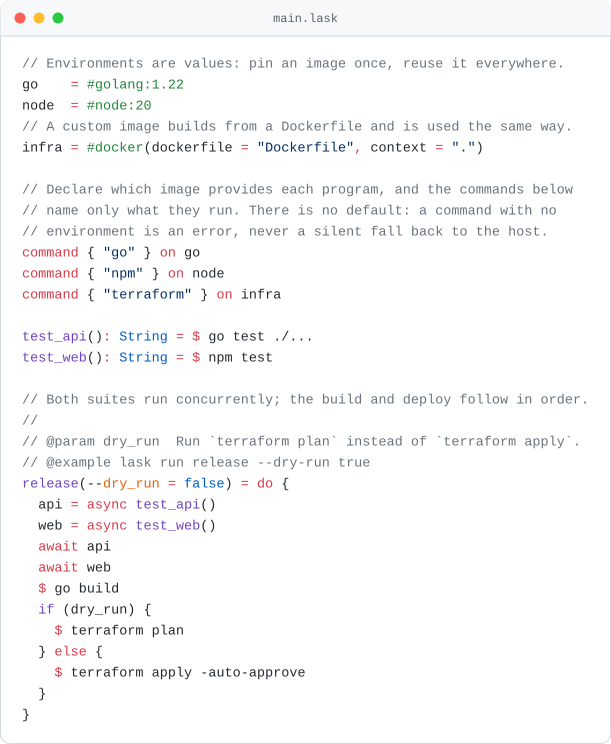

# Lask

[](https://github.com/lask-task-runner/lask/actions/workflows/test.yml)
[](https://github.com/lask-task-runner/lask/releases/latest)
[](LICENSE)

Lask (lambda + task) is a task runner with a small language behind it, giving automation what shell scripts and CI YAML never had: portability, reproducibility, and verification before anything runs.

A `deploy.sh` grows until nobody wants to touch it: no real arguments, no types, no way to exercise one step without running all of them, and a typo three functions down that surfaces only in production. It also only truly works on the machine of whoever wrote it, since it silently inherits their `jq`, their GNU `sed`, their Python. Pipeline YAML you cannot run on your laptop at all, so changing one character means push, wait, read a red log, guess again.

Lask answers each of those in the file itself. A task is an ordinary function — typed keyword arguments, a return value, callable on its own — and the image it runs in is a value written beside the command, so one definition reproduces on any machine. `lask check` resolves every name, argument, and type across the whole file before a single command runs.

<div align="center">
  <picture>
    <source media="(prefers-color-scheme: dark)" srcset="doc/assets/main-dark.svg">
    
  </picture>
</div>

<details>
<summary>Copy the source of this example</summary>

```lask
// Environments are values: pin an image once, reuse it everywhere.
go    = #golang:1.22
node  = #node:20
// A custom image builds from a Dockerfile and is used the same way.
infra = #docker(dockerfile = "Dockerfile", context = ".")

test_api(): String = $[go] go test ./...
test_web(): String = $[node] npm test

// Both suites run concurrently; the build and deploy follow in order.
//
// @param dry_run  Run `terraform plan` instead of `terraform apply`.
// @example lask run release --dry-run true
release(--dry_run = false) = do {
  api = async test_api()
  web = async test_web()
  await api
  await web
  $[go] go build
  if (dry_run) {
    $[infra] terraform plan
  } else {
    $[infra] terraform apply -auto-approve
  }
}
```

</details>

### Install

<details open>
<summary><b>macOS</b> &middot; Homebrew</summary>

```bash
$ brew tap lask-task-runner/tap
$ brew trust lask-task-runner/tap
$ brew install lask
```

</details>

<details>
<summary><b>macOS / Linux</b> &middot; download the binary</summary>

```bash
$ VERSION=$(curl -fsSL https://api.github.com/repos/lask-task-runner/lask/releases/latest | grep -m1 '"tag_name"' | cut -d '"' -f4)
$ TARGET=linux-amd64 # or macos-amd64, macos-arm64
$ curl -fsSL -o lask.tar.gz "https://github.com/lask-task-runner/lask/releases/download/${VERSION}/lask-${VERSION}-${TARGET}.tar.gz"
$ tar -xzf lask.tar.gz
$ sudo mv ./lask /usr/local/bin
```

Uninstall with `sudo rm /usr/local/bin/lask`.

</details>

<details>
<summary><b>Windows</b> &middot; PowerShell</summary>

```powershell
> $version = (Invoke-RestMethod https://api.github.com/repos/lask-task-runner/lask/releases/latest).tag_name
> Invoke-WebRequest -Uri "https://github.com/lask-task-runner/lask/releases/download/$version/lask-$version-windows-amd64.zip" -OutFile lask.zip
> Expand-Archive -Path lask.zip -DestinationPath "$env:LOCALAPPDATA\Programs\lask" -Force
> setx PATH "$env:PATH;$env:LOCALAPPDATA\Programs\lask"
```

Restart your terminal for the updated `PATH` to take effect. Uninstall with
`Remove-Item -Recurse -Force "$env:LOCALAPPDATA\Programs\lask"`.

</details>

<details>
<summary><b>From source</b> &middot; Haskell toolchain</summary>

Needs [GHCup](https://www.haskell.org/ghcup/) or `brew install haskell-stack`.

```bash
$ stack --local-bin-path /usr/local/bin/ install
```

</details>

Verify with `lask --help`. Archives for every platform are on the
[latest release](https://github.com/lask-task-runner/lask/releases/latest); APT and
Chocolatey support is planned.

### Why Lask

- **The feedback loop stays on your laptop.** The typo that used to cost a push and eight minutes of CI now underlines itself as you type: the VS Code extension talks to a language server built into the same binary, raising the same errors, with the same codes, that `lask check` would. In the terminal that check resolves names, arities, and types across every task in milliseconds — over the very definitions CI will run, with no second copy in YAML to drift out of sync.
- **The environment belongs to the task, not to the machine or the runner's config.** A shell script inherits whatever happens to be installed, which is how `sed -i` works for its author and breaks for everyone on the other OS. A CI job pins its image in a file your laptop never reads, which is why "works in CI" and "works here" stay separate questions. In Lask `#golang:1.22` is a value written next to the command, and that same pin applies on every machine that runs the task.
- **Arguments and reuse without the shell tax.** Instead of `"$1"` and `set -u` discipline, tasks take keyword arguments with defaults and declared types. Instead of copying a helper script between repos, you import a module pinned by content hash.

### Comparison

Lask is a task runner, not a build system. Here is how it compares to the tools it most often replaces:

|                                        | Lask | make | just | Task (go-task) |
| -------------------------------------- | :--: | :--: | :--: | :------------: |
| Static checks before execution (`lask check`) | ✅ types, names, arity | — | syntax only | schema only |
| Typed task arguments with defaults      | ✅ `--name: String = "World"` | — | untyped strings | untyped vars |
| Execution environments as values (Docker) | ✅ `$[#golang:1.22]` | — | — | — |
| Concurrency in the language             | ✅ `async` / `await` | `-j` (per-target) | — | `deps` run in parallel |
| Code reuse across projects              | ✅ hash-pinned module imports | `include` | `import` (local) | `includes` |
| File-based incremental rebuilds         | — | ✅ | — | ✅ checksum / timestamp |
| Config format                           | typed language | Makefile | justfile | YAML |
| Install                                 | single binary (Homebrew / Releases) | preinstalled | single binary | single binary |

**When to use something else:**

- If your tasks are primarily *"rebuild only what changed"* over file targets, `make` (or a real build system like Bazel) is the right tool. Lask does not track file freshness.
- If all you need is a flat list of one-line command aliases, `just` is simpler and that simplicity is a feature.

**When Lask pays off:** tasks that take arguments, call each other, run in pinned Docker environments, or run concurrently — the point where Makefiles and YAML pipelines usually turn into untestable shell scripts. `lask check` verifies all of it before anything executes.

### Example

```bash
$ cd ./example/01-basic
$ lask eval hello --name Lask
"Hello, Lask!"
$ lask run cowsay-hello Lask
2026-09-04T15:43:40.248Z [#rancher/cowsay:1] $ cowsay "Hello, Lask!"
2026-09-04T15:43:40.541Z [#rancher/cowsay:1] 1|  ______________
2026-09-04T15:43:40.541Z [#rancher/cowsay:1] 1| < Hello, Lask! >
2026-09-04T15:43:40.542Z [#rancher/cowsay:1] 1|  --------------
2026-09-04T15:43:40.542Z [#rancher/cowsay:1] 1|         \   ^__^
2026-09-04T15:43:40.542Z [#rancher/cowsay:1] 1|          \  (oo)\_______
2026-09-04T15:43:40.543Z [#rancher/cowsay:1] 1|             (__)\       )\/\
2026-09-04T15:43:40.543Z [#rancher/cowsay:1] 1|                 ||----w |
2026-09-04T15:43:40.544Z [#rancher/cowsay:1] 1|                 ||     ||
2026-09-04T15:43:40.858Z [#rancher/cowsay:1] exit 0
```

`hello` is a pure function and needs nothing installed; `cowsay_hello` calls it and
runs the result in a container, so the second command needs Docker. Every command Lask
runs is logged with its environment, its stream (`1|` stdout, `2|` stderr) and its exit
status.

### Editor Support

Because tasks are typed, the editor can help in ways it cannot with a shell script. `lask serve` is a language server built into the same binary, so the VS Code extension gives you the errors `lask check` would report as you type, plus go-to-definition, autocomplete, hover types, and inlay hints for inferred ones.

Install the [Lask extension from the VS Code Marketplace](https://marketplace.visualstudio.com/items?itemName=ToruIkeda.vscode-lask), or search for "Lask" in VS Code.

### Features

What is in the box, for the reader who is already convinced:

- **Types** — a structural system over `Number`, `String`, `Bool`, `Array<T>`, `Map<T>`, `Record<...>`, `Function<...>`, `AsyncHandle<T>` and `Environment`, checked along with syntax and name resolution before anything executes.
- **Control flow** — `do`, `if`/`else`, `for`, `return`, `try`/`catch`/`finally` and `async`/`await`, all normalized onto a small functional core.
- **Commands** — `$ cmd` captures stdout, `$2 cmd` stderr, `$* cmd` the whole result. Prefix with an environment to choose where it runs: `$[#alpine:3.20] cmd` for an image, or `$[#docker(dockerfile = "...", context = ".")] cmd` to build one, with optional `memory` and `cpus` limits.
- **Modules** — named and namespace imports over `./`-relative paths, `stdin` bound as a string, JSON in and out.
- **Dependencies** — declared in `lask.json`, pinned by content hash in a committed `lask.lock.json` (`lask deps add` / `sync` / `why`). `check`, `run` and `eval` refuse a stale lock and resolve nothing it does not already pin, so execution touches no network — only a verified local cache.
- **Observability** — trace IDs, `call`/`return`/`fail` events (`--format json`), stack traces, and exit codes fixed by the spec.

Every one of these is defined normatively in [doc/spec.md](doc/spec.md).

### Usage

```bash
$ lask check                       # static validation
$ lask run <function> [args...]    # execute (result not printed)
$ lask eval <function> [args...]   # execute and print the result as JSON
$ lask envs [--check]              # list/check referenced environments
$ lask env build | list            # materialize / inspect container images
$ lask deps sync                   # fetch + verify external dependencies
$ lask deps add <name> --git <url> --rev <rev>   # or --url <url>
$ lask deps why <name>             # show why a dependency is in the graph
$ lask repl                        # interactive session
$ lask serve                       # language server (LSP)
$ lask version                     # print the lask version
```

Function and keyword-argument names map from kebab-case on the CLI: `lask run show-version --out-dir /tmp` calls `show_version(--out_dir ...)`.

#### Every task documents itself

Types are already in the source, so `--help` does not need a hand-written usage string. It reports the signature, the return type it inferred, and — because environments are values rather than strings — every image the task will need, before you run it:

```bash
$ lask run release --help
Usage:
  lask run release [--dry_run <Bool>]

Parameters:
  --dry_run : Bool = false
      Run `terraform plan` instead of `terraform apply`.

Returns:
  String

Environments:
  Dockerfile  docker       recipe Dockerfile
  docker      golang:1.22
  docker      node:20

Examples:
  lask run release --dry-run true

Defined at main.lask:14
```

The prose comes from the documentation comment above the declaration: its first paragraph is the summary, and `@param`, `@return`, and `@example` lines fill in the rest ([spec 3.1](doc/spec.md)). The same text is what the editor shows on hover.

### Status

Lask is pre-1.0: features are `experimental` until the first tagged release, and breaking changes are still possible. See [doc/compatibility.md](doc/compatibility.md) for what `stable` will mean once released.

### Development

```bash
$ lask run test
```
