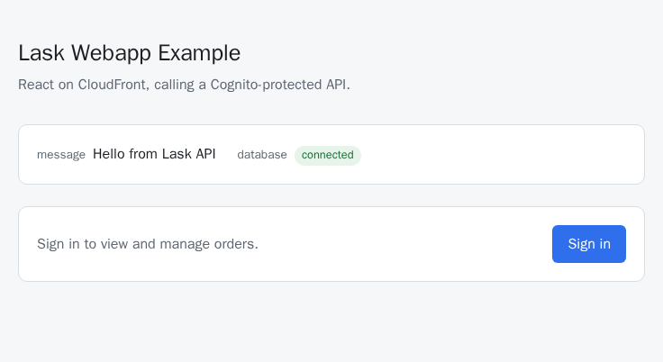
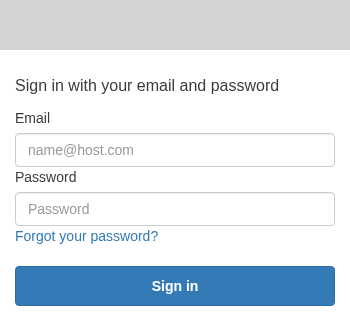
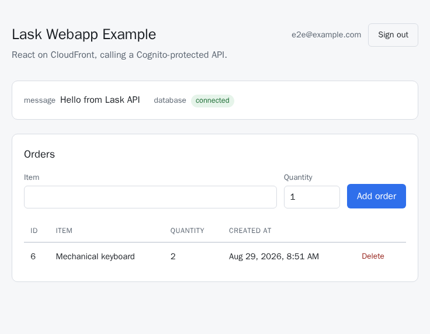

This is Lask applied to a real project: a small full-stack app — a Python API, a React frontend, and all the AWS infrastructure to run them — where every build, test, and deploy step is a Lask task. Follow along and you'll have it running on AWS in about 15 minutes.

## Try it right now

You need **Lask** and **Docker**. Nothing else — no Python, no Node.js, no
Terraform, no AWS CLI, and for this first step, not even an AWS account:

```bash
cd example/04-webapp
lask run test
```

That runs the API's Python tests and the frontend's JavaScript tests, each
inside its own container. The toolchains come down as Docker images and are
thrown away afterwards; nothing lands on your machine.

## What the tasks look like

Everything lives in [main.lask](main.lask). A few excerpts, to give you the
shape of it.

A task is a name, an environment, and a command. The `$[#...]` part picks
the Docker image it runs in — which is why you didn't need Python
installed:

```lask
test_api() = $[#python:3.10.21-alpine3.24] pip install -q --no-cache-dir -r api/requirements.txt && python -m unittest discover -s api -p "test_*.py"
```

Tasks call other tasks, so you compose them instead of repeating yourself.
That's all `lask run test` was:

```lask
test() = do {
  test_api()
  test_web()
}
```

A command's output can be bound to a variable and interpolated into the
next one with `#{...}`, and a task can declare what it returns:

```lask
type Healthcheck = Record<status: String>

healthcheck_web(): Healthcheck = do {
  url = $[#terraform-aws-cli] terraform -chdir="infra" output -raw website_url
  status = $[#curlimages/curl:8.21.0] curl -s -o /dev/null -w "%{http_code}" "#{url}"
  return { status: status }
}
```

Note the two different images in one task: Terraform and curl each run in
their own container, and neither is installed on your machine.

Parameters can default to an environment variable, and marking one `!!`
keeps it out of the logs — `deploy` prints `AWS_SECRET_ACCESS_KEY="***"`
instead of your real key:

```lask
deploy(
  --region: String = get_env("AWS_DEFAULT_REGION"),
  --access_key_id!!: String = get_env("AWS_ACCESS_KEY_ID"),
  --secret_key!!: String = get_env("AWS_SECRET_ACCESS_KEY")
) = do {
  ...
}
```

## What you're building

A cheap, disposable AWS stack.

| Piece | What it does |
| --- | --- |
| [api/](api) — Python on Lambda | the REST API |
| [web/](web) — React | the frontend |
| S3 (private bucket) + CloudFront | serves the frontend |
| RDS (Postgres) | persistence |
| AWS Cognito | sign-in and authorization (OIDC) |
| [infra/](infra) — Terraform | defines all of the above |

## Setting up AWS

This is the only fiddly part, and it's AWS's doing rather than Lask's.

You'll need an AWS account and an IAM user (or role) with these managed
policies attached: `AWSLambda_FullAccess`, `AmazonRDSFullAccess`,
`AmazonVPCFullAccess`, `AmazonS3FullAccess`, `IAMFullAccess`,
`AmazonCognitoPowerUser`, `AmazonAPIGatewayAdministrator`, and
`CloudFrontFullAccess`.

Drop that user's credentials into a `.env` file in this directory:

```bash
cd example/04-webapp

cat > .env <<'EOF'
export AWS_DEFAULT_REGION=us-west-1
export AWS_ACCESS_KEY_ID=AKIA...
export AWS_SECRET_ACCESS_KEY=...
EOF
```

`.env` is already in [.gitignore](.gitignore), so it won't end up in a
commit. Run `source .env` before the commands below — that's where the
`get_env` defaults you saw on `deploy` read from.

## The full loop

```bash
cd example/04-webapp
source .env

lask run deploy       # infra, build, upload. grab a coffee

lask run create_user you@example.com 'Passw0rd123'   # you'll need this to log in

lask run healthcheck_api
lask run healthcheck_web

# open this URL in a browser and sign in with the user you just created
lask eval --stdout-encode text terraform_output website_url

lask run test_e2e     # optional: a real browser clicking through the app for you

lask run destroy      # done playing around? tear it all down
```

That's the whole thing. `lask run test_api` / `lask run test_web` run one
half of `test` on its own, and `test_e2e` needs a deployed site and a real
user, so it's deliberately kept out of `test`.

None of this is specific to your laptop, either — a CI job would run the
same `lask run` commands.

## Logging in

1. Open the site URL from above. You'll land signed out, with a health
   panel and a **Sign in** button.

   

2. Click **Sign in** — Cognito's own Hosted UI takes over. Enter the email
   and password you gave `create_user` (self sign-up is disabled, so that
   task is the only way to get a login; the password needs 8+ characters
   with upper/lowercase letters and a digit).

   

3. You're bounced back to the app, now showing an **Orders** panel — add an
   order and watch it show up in the table.

   

4. **Sign out** ends the Cognito session too, so signing back in asks for
   your password again rather than letting you straight back in.

## Checking it for real

`test` mocks everything interesting away — `fetch`, Cognito, the works.
`lask run test_e2e` doesn't: it drives a real browser against the deployed
site, signs in through the actual Cognito Hosted UI, and creates, lists,
and deletes an order for real ([e2e/](e2e)). It needs `E2E_EMAIL` and
`E2E_PASSWORD` in `.env`, matching a user you've already created.

## Good to know

- **RDS (`db.t4g.micro`, single-AZ, 20GB gp3) is billed the whole time it's
  running** (roughly $10-20/month in a US region, plus storage) — run
  `lask run destroy` once you're done.
- **CloudFront is slow** (5-15 minutes to create, 15+ to delete), so
  `deploy` / `destroy` take longer than you'd expect.
- The Lambda lives in your account's default VPC so it can reach RDS
  ([infra/rds.tf](infra/rds.tf)). No default VPC in your account/region?
  Create one first.
